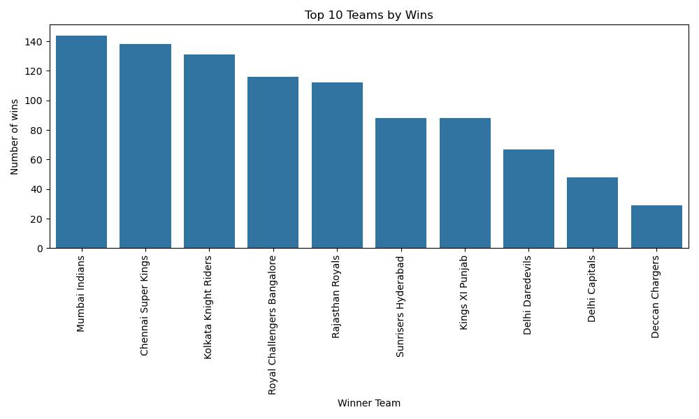
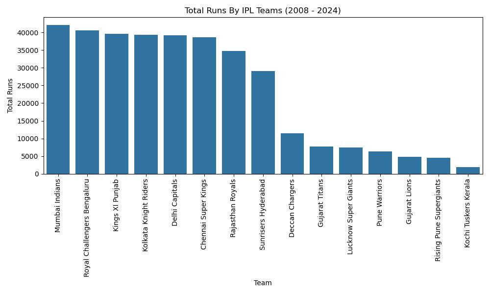
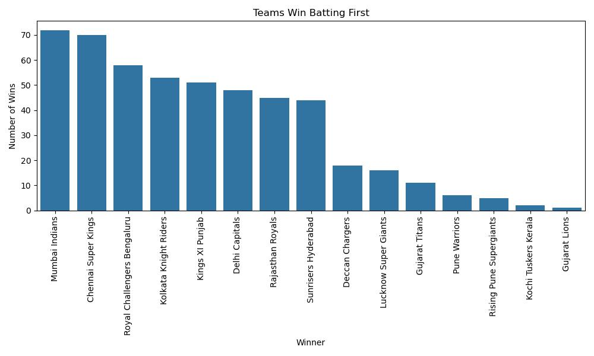
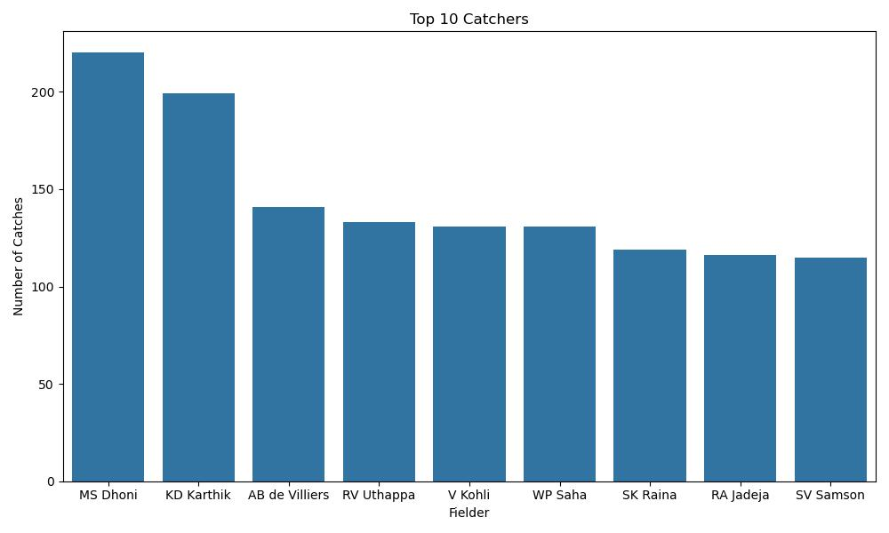

# IPL Performance Predictor

An **end-to-end Machine Learning & Data Analytics application** built on **IPL (Indian Premier League)** data.  
This project provides **interactive analytics dashboards, team & player rankings, and ML-based predictions** using **Streamlit**.

---

## Project Overview

The **IPL Performance Predictor** analyzes historical IPL data to:

- Visualize key tournament insights
- Rank teams, batsmen, and bowlers
- Predict match winners
- Predict batsman runs and bowler wickets
- Provide an interactive, production-style web UI

The project demonstrates **data engineering, feature engineering, machine learning, and deployment-ready UI design**.

---

## Key Features

### Home Dashboard
- Overview of IPL analytics
- Visual insights including:
  - Top teams by wins
  - Total runs by teams
  - Toss impact on match results
  - Home vs away wins
  - Top batsmen, bowlers, fielders, six-hitters

### Rankings Section
- **Team Rankings**
  - By total wins
  - By total runs
  - By total sixes
- **Player Rankings**
  - Top batsmen by total runs
  - Bowlers ranked by runs conceded
- Rankings start from **Rank 1**
- Players mapped to their **latest team**

### Predictions Section
- **Match Winner Prediction**
  - Inputs: Team 1, Team 2, Venue, Toss Winner, Toss Decision
- **Batsman Runs Prediction**
  - Uses rolling averages (last 5 & 10 matches)
- **Bowler Wickets Prediction**
  - Predicts **whole-number wickets**

---

## Machine Learning Models

| Prediction Task | Model |
|-----------------|-------|
| Match Winner | Classification Model |
| Batsman Runs | RandomForest Regressor |
| Bowler Wickets | RandomForest Regressor |

- Feature engineering using rolling averages
- Pipelines with preprocessing & encoding
- Models saved using `pickle`

---

## Datasets Used

| File | Description |
|-----|------------|
| `matches.csv` | Match-level IPL data |
| `deliveries.csv` | Ball-by-ball IPL data (25.7 MB) |
| `batsman_match_stats.csv` | Latest batsman rolling stats |
| `bowler_latest_stats.csv` | Latest bowler rolling stats |

---

## Screenshots & Visualizations

### Team & Match Insights

---

### Player Performance

---

### Toss Analysis

---

## Tech Stack

- **Programming Language:** Python
- **Data Analysis:** Pandas, NumPy
- **Machine Learning:** Scikit-learn
- **Visualization:** Matplotlib, Seaborn
- **Web Framework:** Streamlit
- **Model Serialization:** Pickle
- **Version Control:** Git & GitHub

---
