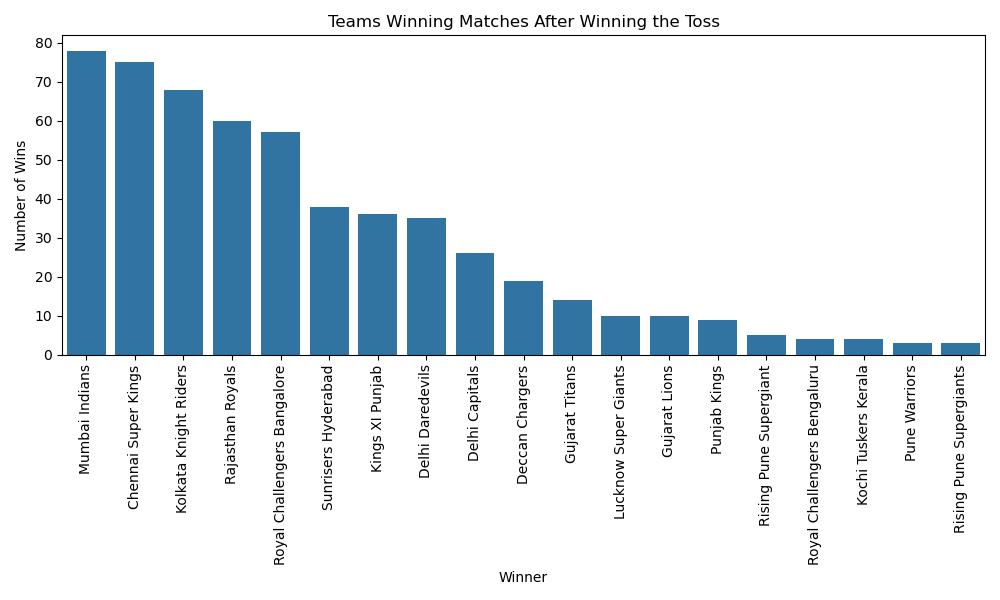

# 🏏 IPL Performance Predictor

> An end-to-end sports analytics and machine learning application built on Indian Premier League data — featuring interactive dashboards, player/team rankings, and live ML-powered predictions.

🔗 **[Live App → Try it now](https://ipl-predictions-ytddudnshpqg3sa5sqwqcx.streamlit.app/)**

---

## 🧩 Problem Statement

Sports analytics is one of the fastest-growing fields in data science. IPL generates millions of data points every season, but most fans and analysts lack tools to make sense of it. This project answers three core questions:

1. **Which team is most likely to win a given match?** (based on venue, toss, and opponent)
2. **How many runs will a batsman score in their next game?** (based on recent form)
3. **How many wickets will a bowler take?** (based on rolling performance metrics)

Beyond predictions, the app surfaces analytical insights from historical IPL data that reveal what actually wins matches — not just intuition.

---

## 🔍 Key Analytical Insights

### 🏆 What Wins Matches?
- **Toss winners who choose to field first** win matches at a higher rate — suggesting chasing is the preferred strategy in T20
- **Home venue advantage is real** — teams playing at their home ground consistently outperform away records
- **Top 3 teams by wins** dominate disproportionately, suggesting sustained squad depth matters more than individual seasons

### 🏏 Batting Patterns
- **Rolling form (last 5 matches)** is a stronger predictor of next-game runs than career averages — current form beats history
- The **top 10 batsmen** account for a disproportionate share of total tournament runs, highlighting how T20 is driven by a few match-winners
- **Six-hitting ability** correlates strongly with high-scoring innings, not just strike rate

### 🎳 Bowling Patterns
- **Economy rate over recent games** is more predictive of wickets than career bowling average
- **Death-over bowlers** show high variance — making them harder to predict but critical to model separately

---

## 💡 Business / Strategic Recommendations

1. **Teams should prioritize fielding first after winning the toss** — data consistently supports this as the higher win-probability decision
2. **Player auction strategy should weight recent form (last 5–10 matches) over career stats** — form-based features outperform historical averages in predictions
3. **Invest in top-order batsmen with high six-hitting rates** — these players drive the most match-winning innings
4. **Schedule home fixtures during critical knockout phases** — home advantage is a statistically significant factor

---

## 🚀 App Features

### 📊 Home Dashboard
- Top teams by wins, total runs, and sixes
- Toss impact analysis on match results
- Home vs away win breakdown
- Top 10 batsmen, bowlers, fielders, and six-hitters

### 🏅 Rankings
- Team rankings by wins, runs, and sixes
- Batsman rankings by total runs (mapped to latest team)
- Bowler rankings by performance metrics

### 🤖 Predictions
| Prediction | Inputs | Model |
|---|---|---|
| Match Winner | Team 1, Team 2, Venue, Toss Winner, Toss Decision | Classification |
| Batsman Runs | Player name, rolling form stats | RandomForest Regressor |
| Bowler Wickets | Player name, recent economy & form | RandomForest Regressor |

---

## 📊 Datasets Used

| File | Description |
|------|-------------|
| `matches.csv` | Match-level IPL data (results, venues, toss outcomes) |
| `deliveries.csv` | Ball-by-ball delivery data for all matches |
| `batsman_match_stats.csv` | Engineered rolling stats per batsman |
| `bowler_latest_stats.csv` | Engineered rolling stats per bowler |

---

## 🛠️ Tech Stack

| Area | Tools |
|------|-------|
| Data Analysis | Pandas, NumPy |
| Feature Engineering | Rolling averages (last 5 & 10 matches), encoding |
| Machine Learning | Scikit-learn (RandomForest, Classification Pipeline) |
| Visualization | Matplotlib, Seaborn |
| Deployment | Streamlit (multi-page app) |
| Model Serialization | Pickle |
| Version Control | Git & GitHub |

---

## 🏗️ Project Structure

```
IPL-Predictions/
│
├── app.py                        # Main Streamlit app entry point
├── pages/                        # Multi-page Streamlit structure
│   ├── rankings.py               # Team & player rankings page
│   └── predictions.py            # ML prediction page
├── ipl.ipynb                     # EDA + feature engineering + model training
├── matches.csv                   # Match-level dataset
├── deliveries.csv                # Ball-by-ball dataset
├── batsman_match_stats.csv       # Engineered batsman features
├── bowler_latest_stats.csv       # Engineered bowler features
├── model.pkl                     # Trained match prediction model
├── match_pred.pkl                # Match prediction pipeline
├── bowler_model.pkl              # Bowler wickets prediction model
├── images/                       # Dashboard screenshots
├── requirements.txt              # Python dependencies
└── README.md
```

---

## 📸 Screenshots

### Team & Match Insights
| Top Teams by Wins | Total Runs by Teams |
|---|---|
|  |  |

### Toss Analysis
| Toss Impact | Toss Win vs Match Win |
|---|---|
|  |  |

### Player Performance
| Top Batsmen | Top Bowlers |
|---|---|
|  |  |

---

## ⚙️ Run Locally

```bash
# Clone the repo
git clone https://github.com/jay51211/IPL-Predictions.git
cd IPL-Predictions

# Install dependencies
pip install -r requirements.txt

# Launch the app
streamlit run app.py
```

---

## 🔮 Future Improvements

- Add player vs player head-to-head analysis
- Incorporate live match data via IPL API for real-time predictions
- Add confidence scores to match winner predictions
- Introduce a fantasy team recommendation engine based on predicted form

---

## 👤 Author

**Jay Kumbhar**
📧 jaykumbhar518@gmail.com
💼 [LinkedIn](https://linkedin.com/in/jaykumbhar5121) | 💻 [GitHub](https://github.com/jay51211)
