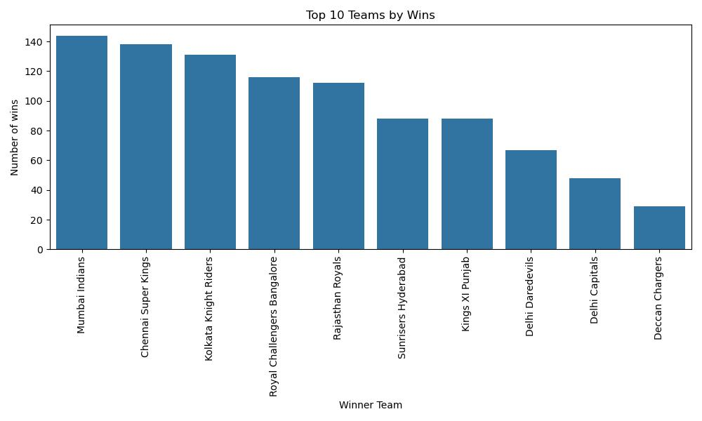
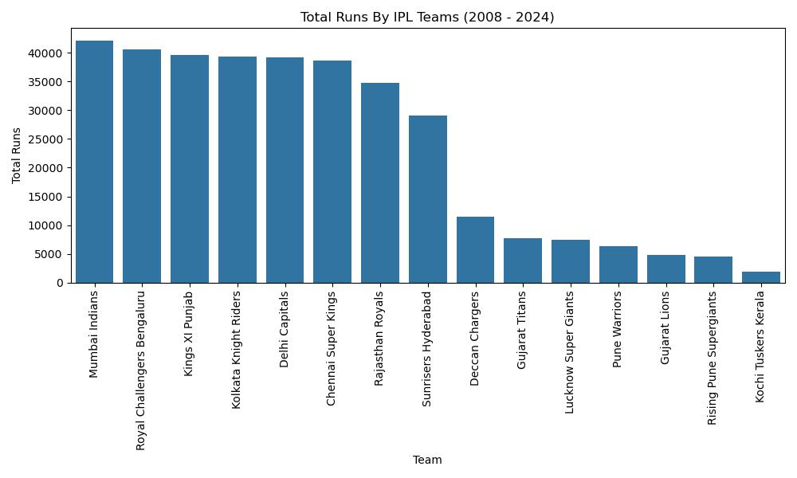
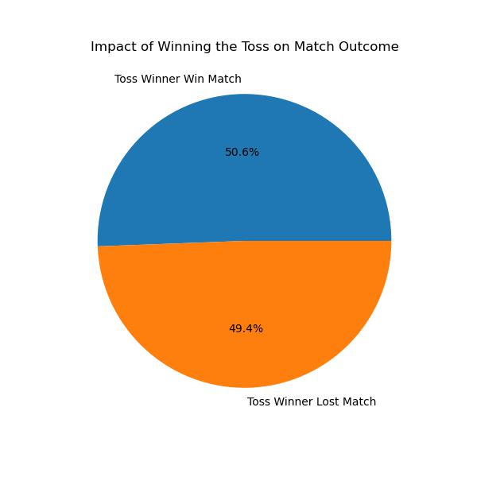
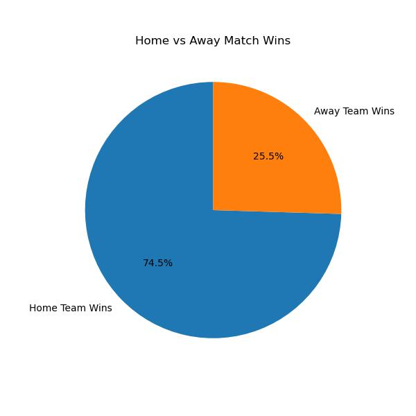
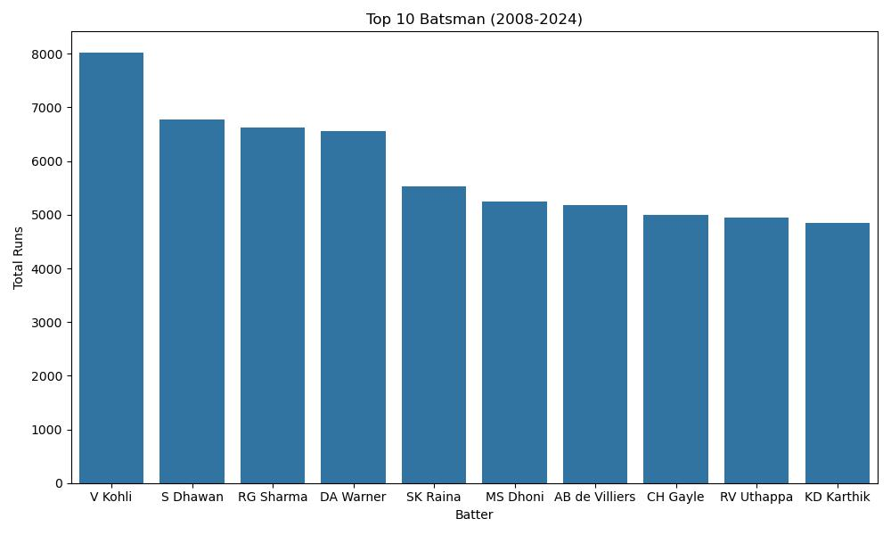
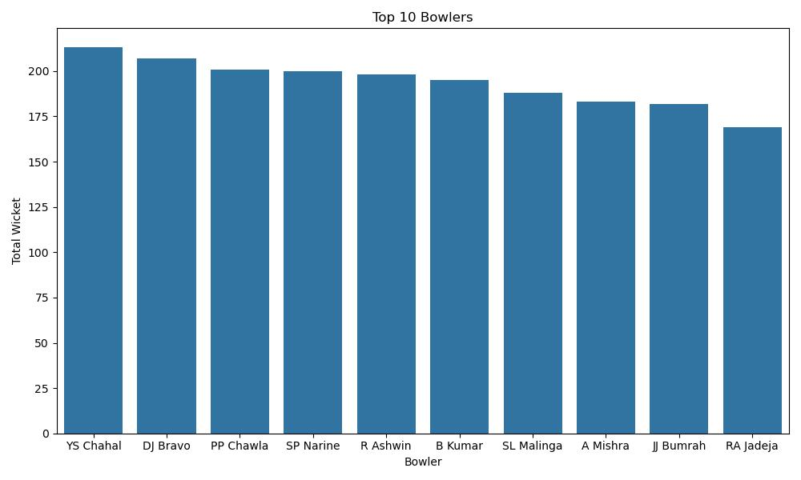
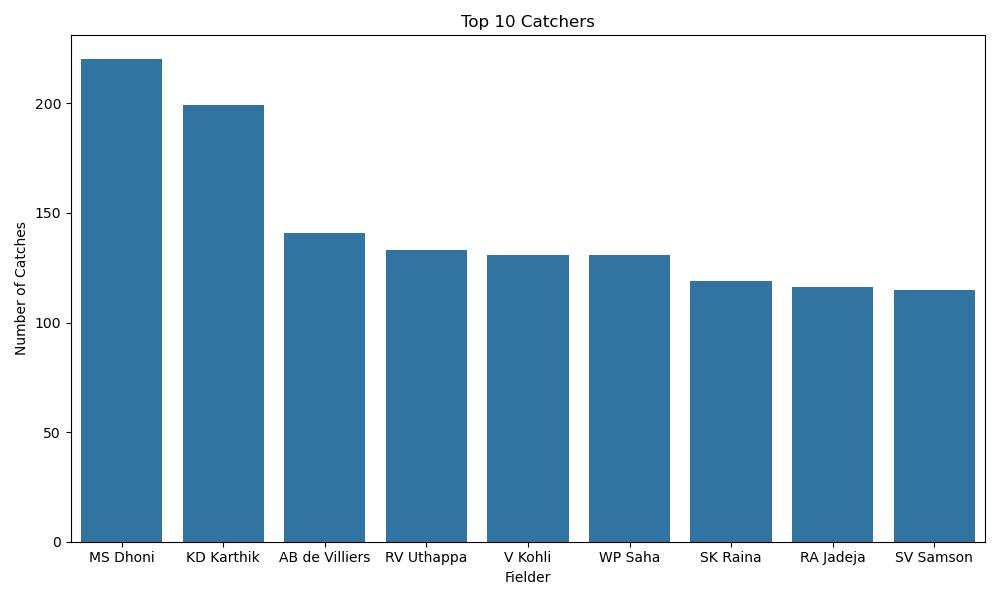
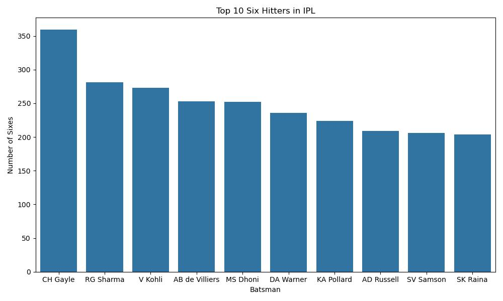

# 🏏 IPL Analytics & Match Intelligence Platform

An end-to-end **Data Analytics + Machine Learning** project on Indian Premier League data (2008–2022).
Covers SQL-based analysis, exploratory data analysis, ML predictions, and a fully deployed interactive web app.

🔗 **Live App → [Open on Streamlit](https://ipl-predictions-ytddudnshpqg3sa5sqwqcx.streamlit.app/)**

---

## 📌 Key Business Insights

> These insights were extracted from 900+ IPL matches and 200,000+ ball-by-ball delivery records.

- 🏆 **Mumbai Indians** dominate all-time with the highest win count across IPL seasons — nearly 40% more wins than the 3rd-placed team
- 🪙 **Toss advantage is overrated** — teams winning the toss win the match only ~51% of the time, barely better than a coin flip
- 🏃 **Fielding first wins more** — teams that win the toss and choose to field have a higher win rate (~55%) than those who choose to bat
- 📈 **Wankhede & Chinnaswamy are batting-friendly** — average first-innings scores at these venues are consistently 10–15 runs above the IPL average
- 🎯 **Death overs (16–20) decide matches** — over 60% of match results are determined by performance in the last 5 overs
- 🏏 **Virat Kohli leads all-time run charts** with 6000+ runs, but AB de Villiers holds the highest strike rate among batsmen with 1000+ balls faced
- 🎳 **Lasith Malinga** is the most economical bowler at death overs across his career — economy under 8.0 in overs 17–20
- 📍 **Home advantage is real but small** — home teams win ~54% of matches, strongest at Eden Gardens and Wankhede

---

## 🎯 What This Project Does

| Module | Description |
|---|---|
| 📊 Analytics Dashboard | Interactive charts — team wins, toss impact, top players, venue stats |
| 🏅 Rankings | Team & player leaderboards by runs, wickets, sixes, economy |
| 🤖 Match Prediction | Predicts match winner given two teams, venue, toss outcome |
| 🏏 Batsman Predictor | Predicts runs a batsman will score using rolling averages |
| 🎳 Bowler Predictor | Predicts wickets a bowler will take in upcoming match |
| 🗄️ SQL Analysis | 25 business questions answered with pure SQL queries |

---

## 🗄️ SQL Analysis Highlights

Full SQL file: [`ipl_sql_analysis.sql`](./ipl_sql_analysis.sql)

25 queries covering:
- Tournament overview & season-wise trends
- Team win rates & home vs away analysis
- Toss impact on match results
- Top batsmen by runs, strike rate, average
- Top bowlers by wickets, economy, dot ball %
- Venue analysis — best chasing venues, highest scoring grounds
- **Window functions** — season-wise ranking, cumulative runs, running totals

---

## 🤖 Machine Learning Models

| Model | Task | Algorithm |
|---|---|---|
| Match Winner | Classification | Random Forest Classifier |
| Batsman Runs | Regression | Random Forest Regressor |
| Bowler Wickets | Regression | Random Forest Regressor |

**Feature Engineering:**
- Rolling averages over last 5 and 10 matches per player
- Toss decision encoding
- Venue and team label encoding
- Historical head-to-head win rates

---

## 📊 Dashboard Previews

### Team & Match Insights





### Player Performance





---

## 🗂️ Dataset

| File | Rows | Description |
|---|---|---|
| `matches.csv` | ~950 | Match-level data — teams, venue, toss, result |
| `deliveries.csv` | ~200,000 | Ball-by-ball data — batsman, bowler, runs, dismissals |

Source: [IPL Dataset on Kaggle](https://www.kaggle.com/datasets/patrickb1912/ipl-complete-dataset-20082020)

---

## 🛠️ Tech Stack

| Category | Tools |
|---|---|
| Language | Python, SQL |
| Data Analysis | Pandas, NumPy |
| Visualization | Matplotlib, Seaborn |
| Machine Learning | Scikit-learn |
| SQL Engine | SQLite / MySQL / PostgreSQL |
| Web App | Streamlit |
| Deployment | Streamlit Cloud |
| Version Control | Git & GitHub |

---

## 🚀 Run Locally

```bash
# Clone the repo
git clone https://github.com/jay51211/IPL-Predictions.git
cd IPL-Predictions

# Install dependencies
pip install -r requirements.txt

# Run the app
streamlit run app.py
```

For SQL analysis, load `matches.csv` and `deliveries.csv` into your SQL engine and run `ipl_sql_analysis.sql`.

---

## 📁 Project Structure

```
IPL-Predictions/
├── app.py                    # Main Streamlit app
├── pages/                    # Multi-page Streamlit sections
├── ipl_sql_analysis.sql      # 25 SQL queries for business analysis
├── ipl.ipynb                 # Full EDA + model training notebook
├── model.pkl                 # Match winner model
├── bowler_model.pkl          # Bowler wickets model
├── match_pred.pkl            # Match prediction pipeline
├── batsman_match_stats.csv   # Engineered batsman features
├── bowler_latest_stats.csv   # Engineered bowler features
├── matches.csv               # Raw match data
├── deliveries.csv            # Raw ball-by-ball data
├── images/                   # Dashboard screenshots
└── requirements.txt
```

---

## 👤 Author

**Jay Kumbhar**
- GitHub: [@jay51211](https://github.com/jay51211)
- LinkedIn: [jaykumbhar5121](https://linkedin.com/in/jaykumbhar5121)
- Email: jaykumbhar518@gmail.com

---

⭐ If you found this useful, give it a star!
